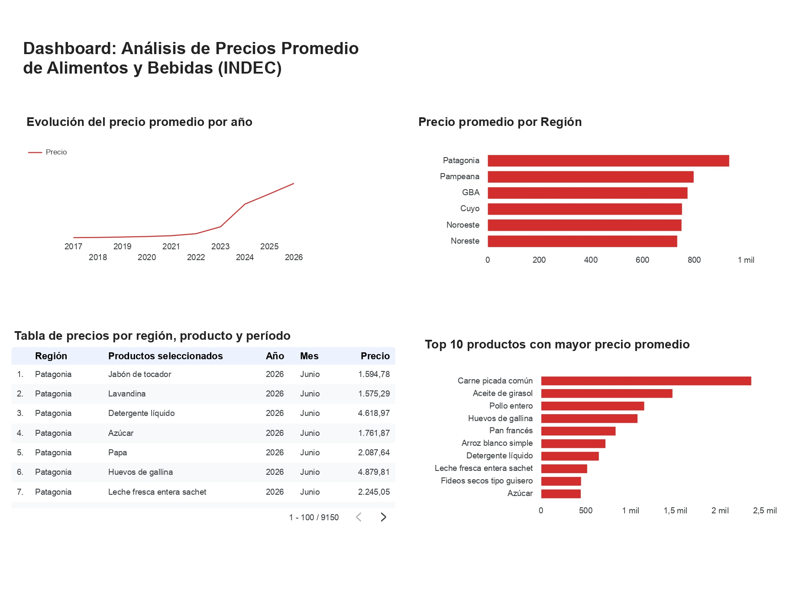

# 📊 Análisis de Precios Promedio de Alimentos y Bebidas (INDEC)

## 📖 Descripción

Este proyecto analiza datos oficiales del Índice de Precios al Consumidor (IPC) publicados por el Instituto Nacional de Estadística y Censos (INDEC), con foco en los precios promedio de alimentos y bebidas.

A partir de un archivo Excel con una estructura compleja, se realizó la limpieza y transformación de los datos mediante Python y Pandas para analizar la evolución de los precios a lo largo del tiempo, las diferencias entre regiones y los productos con mayores precios promedio.

Los resultados se presentan en un dashboard interactivo desarrollado en Data Studio, que permite explorar la información mediante filtros por año, región y producto.

---

## 🎯 Objetivos

- Analizar la evolución de los precios promedio de los productos seleccionados a lo largo del período 2017–2026.
- Comparar los precios promedio registrados entre las distintas regiones.
- Identificar los productos con mayores precios promedio dentro del conjunto de datos analizado.
- Facilitar la exploración de los resultados mediante un dashboard interactivo con filtros por año, región y producto.

---

## 🛠️ Tecnologías utilizadas

- Python
- Pandas
- Jupyter Notebook
- Microsoft Excel
- Data Studio

---

## 📂 Contenido del repositorio

- **Análisis_de_Precios_al_Consumidor_(IPC).ipynb** → Notebook con el desarrollo completo del proyecto.
- **ipc_limpio.csv** → Dataset limpio generado durante el análisis.
- **sh_ipc_precios_promedio.xlsx** → Archivo original utilizado como fuente de datos.

---

## 📈 Dashboard

El dashboard permite analizar la información mediante filtros por:

- Año
- Región
- Producto

Incluye las siguientes visualizaciones:

- Evolución del precio promedio por año.
- Precio promedio por región.
- Top 10 productos con mayor precio promedio.
- Tabla interactiva por región, producto y período.

> 📷 **Captura del dashboard**
>
> 

---

## 📌 Principales resultados

- El precio promedio registrado pasó de **28,81 en 2017 a 3.083,71 en 2026**, mostrando un incremento sostenido a lo largo del período analizado.
- **Patagonia** presentó el mayor precio promedio regional, con **936,29**, mientras que **Noreste** registró el menor, con **735,13**.
- Entre los productos analizados, **carne picada común** presentó el mayor precio promedio, con **2.350,82**, seguida por **aceite de girasol (1.471,18) y pollo entero (1.155,88)**.
- El dashboard permite explorar estos resultados según **año, región y producto**, facilitando la comparación de los precios promedio dentro del período analizado.

---

## 📊 Fuente de datos

Instituto Nacional de Estadística y Censos (INDEC).

---

## 🔗 Enlaces

**Google Colab**

https://colab.research.google.com/drive/1M2cjO4ThMqKJDzB9FWS2nUhVu9AGTmNS#scrollTo=ovmdT11ZFWAv

**Data Studio:**

https://datastudio.google.com/u/0/reporting/05bca233-a618-433c-bd4f-48fe7144c6cc/page/WIv4F

---

## 👤 Autor

**Mariano Zamora**

Licenciado en Administración | Portfolio de Análisis de Datos

